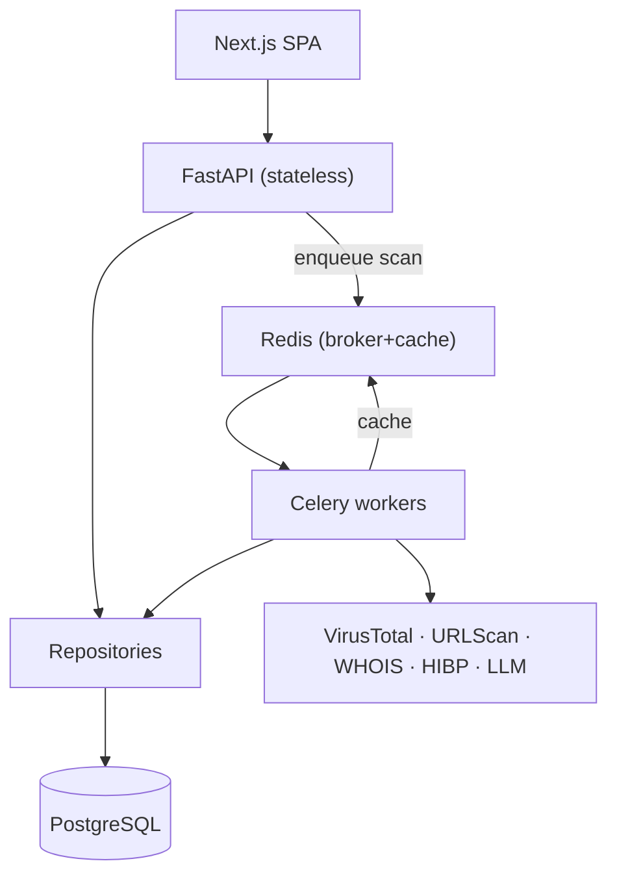
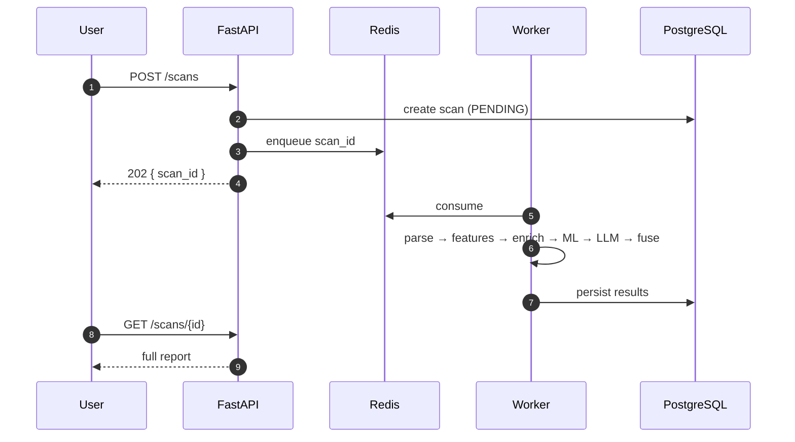
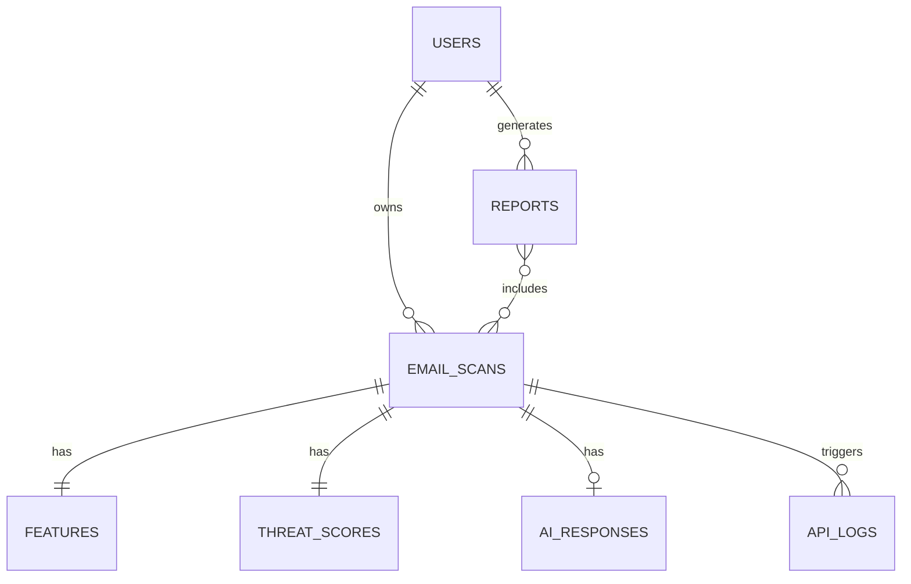

# Catchy — Architecture

> Layered phishing detection that fuses deterministic email forensics, a calibrated ML
> classifier, and an LLM analyst into a single **explainable** 0–100 risk score.

**Core principle:** the LLM never decides the verdict. Deterministic forensics and a
trained model produce the score; the LLM only *explains* it. This keeps the system
testable, prompt-injection-resistant, and auditable.

> An interactive version of this document (with rendered diagrams) is published as a
> Claude artifact. This file is the source-of-truth copy that lives with the code.

---

## 1. System architecture

Three tiers — a Next.js SPA, a stateless FastAPI service, and a Celery worker pool —
with Redis as cache + broker and Postgres as the system of record. Slow work (external
APIs, LLM generation) is pushed off the request path onto workers.



**Key decisions**

- **Stateless API + worker pool.** A scan can touch four external APIs plus an LLM
  (5–15 s). The API only *enqueues* and returns a scan ID; the client polls/subscribes.
- **Redis does double duty** as Celery broker and as a cache for expensive lookups.
- **Raw `.eml` goes to object storage, not Postgres** — blobs bloat the DB; Postgres
  holds structured, queryable results.

## 2. Data flow of a scan



## 3. Detection pipeline (defense in depth)

| Layer | Catches | Contribution |
| --- | --- | --- |
| Header forensics | Spoofing, SPF/DKIM/DMARC fail, Reply-To mismatch | Sender sub-score |
| URL / domain | Look-alikes, IP links, VT/URLScan hits, anchor≠href | URL sub-score |
| Attachment | Dangerous types, MIME/extension mismatch | Attachment sub-score |
| ML classifier | Statistical phishing "shape" | Model confidence (largest weight) |
| LLM analyst | Human-readable rationale + technique attribution | Bounded confidence nudge |

## 4. Risk score

```
score = 100 × ( 0.35·ml_confidence + 0.25·url_subscore
              + 0.20·sender_subscore + 0.10·attachment_subscore
              + 0.10·ai_confidence )
```

ML leads but never dominates; deterministic URL/sender signals are weighted heavily
because they are hard to fake; **AI is capped at 10%** so it explains rather than
decides. A **critical override** floors the score at ≥90 on confirmed-malicious
indicators (e.g. a VT-flagged URL).

| Band | Score |
| --- | --- |
| Safe | 0–24 |
| Suspicious | 25–54 |
| Likely phishing | 55–79 |
| Critical | 80–100 |

## 5. Machine learning

- **Recommendation:** LightGBM (calibrated), with Logistic Regression as the shipped
  baseline to prove the boosted model earns its complexity.
- **Text representation:** TF-IDF first; sentence-embeddings deferred to v2.
- **Calibration:** `CalibratedClassifierCV` (isotonic) so `predict_proba` is
  trustworthy — it feeds the risk formula.
- **Metrics:** recall (primary), precision, F1, PR-AUC / ROC-AUC. Accuracy is *not*
  the headline metric given class imbalance and asymmetric error cost.

## 6. AI explanation layer

The LLM runs **after** the score exists and receives a structured evidence packet,
never the raw email as an instruction. Provider is **Gemini first**, behind a
swappable interface. Output is JSON-schema-constrained. Even a fully successful prompt
injection cannot flip the verdict — the LLM's weight is capped at 10%.

## 7. Database design (ERD)



**Indexing:** `email_scans(user_id, created_at DESC)` for history; `threat_scores
(final_score)` and `(severity_band)` for analytics; GIN on `jsonb` columns.

## 8. Backend architecture

Clean Architecture: **routers → services → repositories**, with FastAPI `Depends` for
dependency injection. Routers stay thin; business logic lives in services; all DB
access goes through repositories (mockable, swappable). JWT auth, Redis-backed rate
limiting, Redis caching of external intel, Celery for background jobs.

<a id="security"></a>
## 9. Security

| Threat | Mitigation |
| --- | --- |
| File uploads | Size caps, MIME allow-list, sandboxed parse, never execute, metadata only |
| Prompt injection | Email as delimited untrusted data; schema-constrained output; LLM can't alter verdict |
| API abuse | Per-user + per-IP rate limits, auth on all data routes, external-quota caps |
| SQL injection | Parameterized queries via SQLAlchemy ORM only |
| XSS | React escaping; sanitize rendered email HTML (DOMPurify) or show as inert text |
| CSRF | Stateless JWT in Authorization header (not cookies) |
| Auth | argon2/bcrypt hashing, short-lived access + rotating refresh tokens |
| Secrets | Env vars via Pydantic Settings; `.env` git-ignored; platform secret stores in prod |
| Docker | Non-root users, slim base images, pinned deps, multi-stage builds |
| Logging | Structured logs, no PII/email content, per-scan correlation IDs |

<a id="roadmap"></a>
## 10. Roadmap

Built in independently-demoable milestones — deterministic detection before ML, ML
before the LLM, frontend last (against a finished, typed API).

| # | Milestone | Demo |
| --- | --- | --- |
| M0 | Foundation & scaffolding | `docker compose up` runs the whole stack |
| M1 | Email parsing engine | Structured JSON for any pasted email |
| M2 | Feature engineering + rule scoring | Rule-based score + indicators (pre-ML) |
| M3 | ML training pipeline | Reproducible `train.py` → model card |
| M4 | Model serving + full fusion | Async scan returns blended verdict |
| M5 | Threat-intel integrations | Real reputation data; critical override |
| M6 | LLM explanation layer | Analyst-grade explanation per score |
| M7 | Auth, persistence & history API | Multi-user comparable history |
| M8 | Frontend dashboard | Full product, clickable end-to-end |
| M9 | Hardening, CI/CD & docs | Green pipeline auto-deploys |
